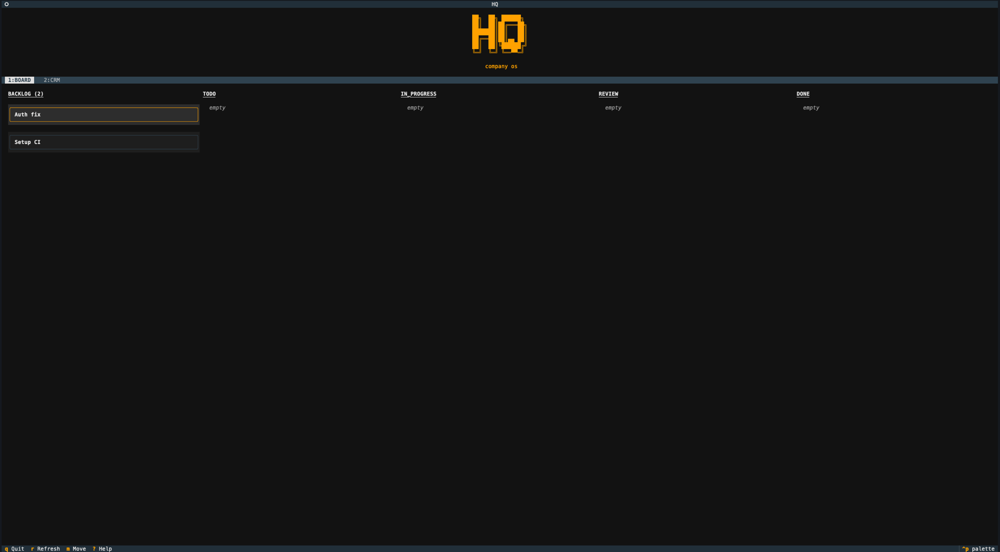

# HQ -- Company OS CLI

> Your entire company's operations from the terminal.

HQ is a CLI-first company operating system for small teams. It replaces bloated SaaS tools with two modules:

- **Board** -- features, bugs, tasks
- **CRM** -- sales pipeline, contacts, deals

All data lives locally in SQLite. No accounts, no cloud, no subscriptions.



## Install

```bash
uv sync
uv run hq --help
```

## CLI Usage

### Board

```bash
hq board add "Auth fix" -d "Fix auth token expiry" -a matti
hq board list
hq board show "auth"
hq board move "auth" in_progress
hq board edit "auth" -t "Auth fix v2" -d "Updated description"
hq board delete "auth"
```

### CRM

```bash
hq crm add "Acme Corp" -d "Enterprise deal"
hq crm add-contact "acme" "Pekka" -e "pekka@acme.com" -p "+358401234567"
hq crm add-contact "acme" "Jane" -e "jane@acme.com"
hq crm contacts "acme"
hq crm show "acme"
hq crm move "acme" proposal
hq crm edit "acme" -t "Acme Corp Inc" -a matti
hq crm remove-contact "acme" "Jane"
hq crm delete "acme"
```

### Global

```bash
hq status                  # Overview across all modules
hq search "acme"           # Full-text search
hq tui                     # Launch TUI
```

## TUI

Launch with `hq tui`. Keyboard-driven kanban board interface.

- `1`/`2` or `[`/`]` -- switch between Board and CRM
- `j`/`k`/`h`/`l` or arrow keys -- navigate cards
- `enter` -- open detail view (editable title and description)
- `m` -- move mode (slide card between stages with `h`/`l`, `escape` to finish)
- `r` -- refresh
- `?` -- help
- `q` -- quit

## Data

All data is stored locally in `~/.hq/hq.db` (SQLite). Configuration in `~/.hq/config.toml`. Deletes are soft -- entities are marked deleted but not removed from the database.

## Tech Stack

Python, Typer, Textual, SQLite (`sqlite-utils`), pyfiglet.

## License

Apache 2.0
